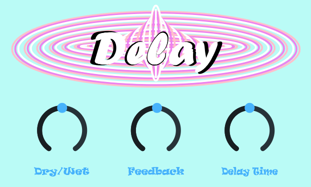

# Delay-Effect-Plugin
## Description
This audio plugin implements a digital delay effect and is intended for use in a music production environment.

Created in C++ using the JUCE API, the plugin can be supported in all platforms and exported in formats such as VST3, AU, and AAX.

The plugin comes with a creative GUI that presents the user with three knobs for control of various effect parameters.

The user can directly adjust the knobs to control Dry/Wet mix, delay time, and feedback of the delay.

## GUI

## Audio Processing
**Difference equation:** y[n] = dry * x[n] + wet * (x[n-D] + feedback * y[n-D])

The flowchart for the audio processing is as follows:

1. Read sample from left and right channels into left and right delay buffers.
2. Calculate the read pointer of the delay buffer based on current UI setting.
3. Read from the delay buffer from the read pointer.
4. Update read pointer.
5. Store current delayed sample as feedback (with feedback amount determined by UI setting).
6. Feed Dry/Wet mix of input signal and delayed signal to output buffer.
7. Update write pointer.

The plugin also features parameter smoothing and linear interpolation in order to improve real-time audio quality and provide
accurate response to UI settings.

It is also able to save and load its state so that, when used in a DAW, the settings used when the file was last saved will
once again be available to the user.
